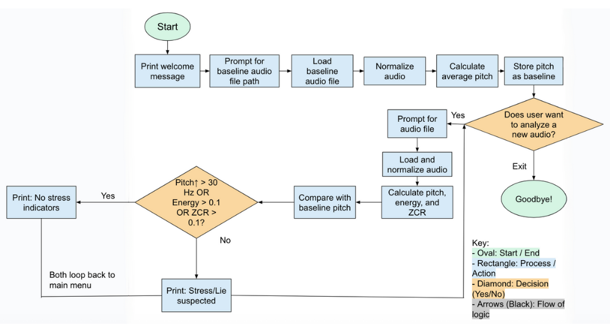

# 🎤 Stress Voice Analyzer (Lie Detector)

A Python-based voice stress analysis tool that compares your speaking voice to a calm baseline to detect possible **stress or deception**. It extracts vocal features such as **pitch**, **energy**, **jitter**, and **zero-crossing rate (ZCR)**, and flags irregularities using tuned thresholds.

## 🚀 Features

- ### 🎯 Baseline Calibration
  - Set your **calm voice** baseline using `baseline.py`.
  - The system calculates and saves your **average pitch** as a reference.

- ### 🔧 Threshold Tuning (`tuner.py`)
  - Upload your **truth** and **lie** samples.
  - The tuner automatically tests hundreds of threshold combinations.
  - Saves the **best-performing thresholds** to `thresholds.json`.

- ### 📊 Lie Detection (`analyzer.py`)
  - Analyze any new recording to estimate truthfulness.
  - Detects stress based on:
    - **Pitch deviation**
    - **Energy (volume)**
    - **Jitter (pitch variability)**
    - **Shimmer (energy variability)**
    - **Zero-crossing rate**
    - **Voiced/silence ratio**
  - Requires **3 or more stress triggers** to flag a lie.
  - Saves results to `voice_analysis_log.csv`.

- ### 🔁 Interactive CLI
  - Looping menu for continuous testing.
  - Easy input for audio file paths.

---

## 🧠 What I Learned

- How to extract and process audio features using `librosa`
- Calculating jitter, shimmer, and energy variation
- Designing configurable thresholds via tuning
- Building reusable and modular CLI tools
- Data logging and CSV handling in Python


## Future Improvements

- Add real-time microphone input for live analysis
- Visualize waveform + pitch over time using matplotlib
- Build a GUI version with Gradio or Tkinter
- Train a machine learning model on larger datasets

## License

This project is licensed under the [MIT License](LICENSE).


---

## 🛠 Requirements

- Python 3.x
- Recommended packages:

```bash
librosa
numpy
pandas

Then install dependencies with:

pip install librosa numpy pandas
```

## Flowchart


